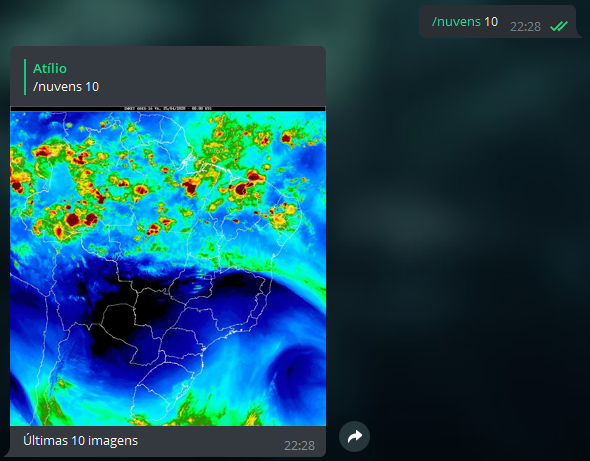
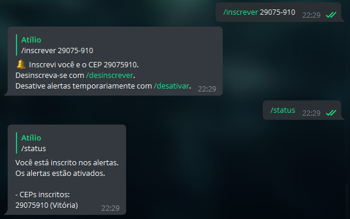
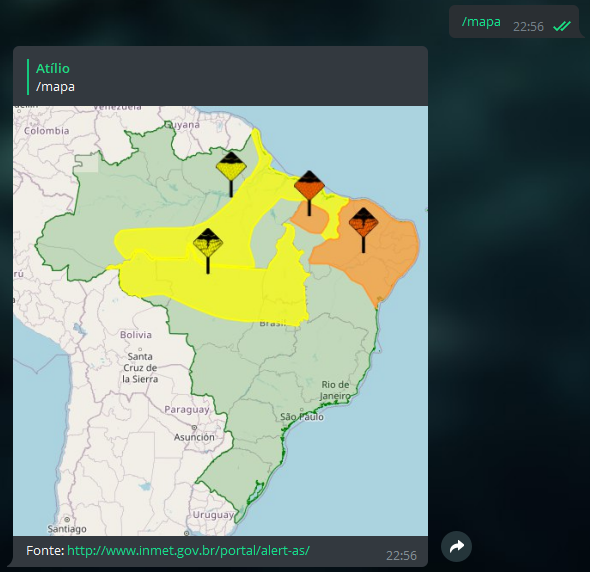

<h1 align="center">
  <a href="https://t.me/INMETBot">🛰 INMETBot</a>
</h1>

<h4 align="center"><a href="https://t.me/INMETBot">@INMETBot</a> - Bot no Telegram para solicitar imagens de satélites e alertas recentes (não filiado ao INMET).

Telegram bot to fetch satellite images and recent alerts (not affiliated to INMET).

</h4>

<h5 align="center">

   

</h5>

## ℹ About

Telegram bot that scrapes INMET's website and makes information available through a [Telegram](http://telegram.org/) bot. It runs on Python 3 and uses MongoDB. You can [try it here](https://telegram.me/INMETBot) (only available in pt-BR).

## 📖 Examples (in pt-BR)

- Creating GIF made of the _10_ last images from the enhanced water vapor satellite:

  

- Subscribing to be notified about alerts affecting subscribed CEPs (zip codes):

  

- Getting the alerts map from Alert-AS:

  

You can learn more with the `/help` command.

## 🏡 Running locally

First, clone the repository and create a virtual environment for the project (to ensure you won't have problems with your libraries versions). Using `pipenv`:

`pipenv install` - Create virtual environment and install dependencies

`pipenv shell` - Activate virtual environment

Some of the bot's functionality depends on being connected to a MongoDB database. If you wish to use your own database, just set the `INMET_MONGO_URI` environment variable in the `.env.example` file to your URI connection string and rename the `.env.example` file to `.env` or, alternatively, set `INMET_MONGO_URI` as an environment variable of the system hosting the bot.

You'll be doing the same thing for the `TELEGRAM_INMETBOT_APIKEY` environment variable. You can get your token/key with [BotFather](t.me/BotFather), the official way to create bots on Telegram.

With everything set, you can start the bot with:

`python main.py`
